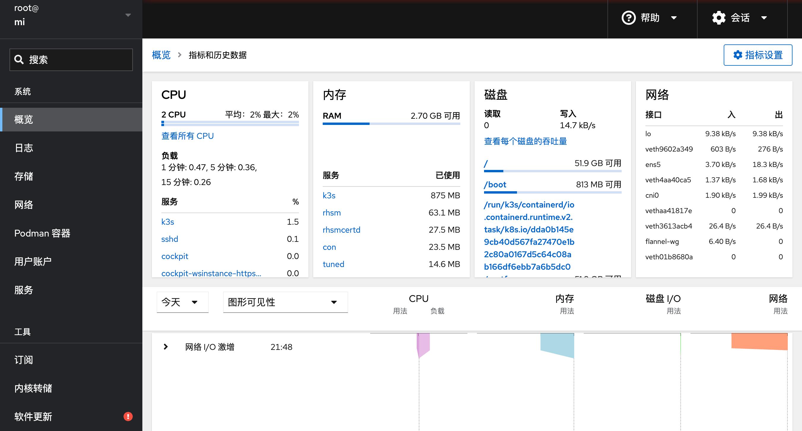

下载[MSIAfterburner.cfg](/backup/MSIAfterburner.cfg)到 `%programfiles(x86)%\MSI Afterburner\Profiles`。当前版本是4.6.6(beta3)，下载地址：[msi官方](https://www.msi.com/Landing/afterburner/graphics-cards)或[guru3d下载](https://www.guru3d.com/download/msi-afterburner-beta-download/)。核心效果是展示各个cpu核心的使用率，如下：

下图是展示aida64提供的电压的配置：

下面是将cpu利用率改成方块的配置：

